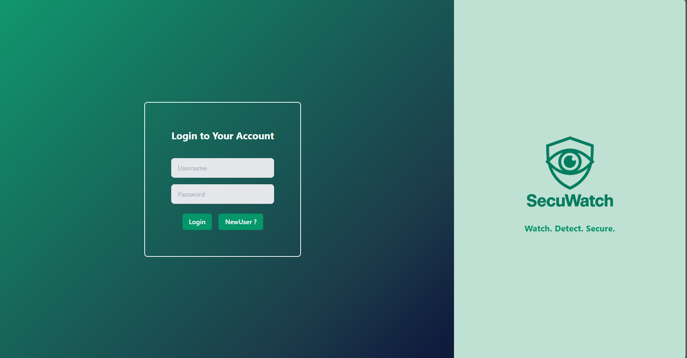
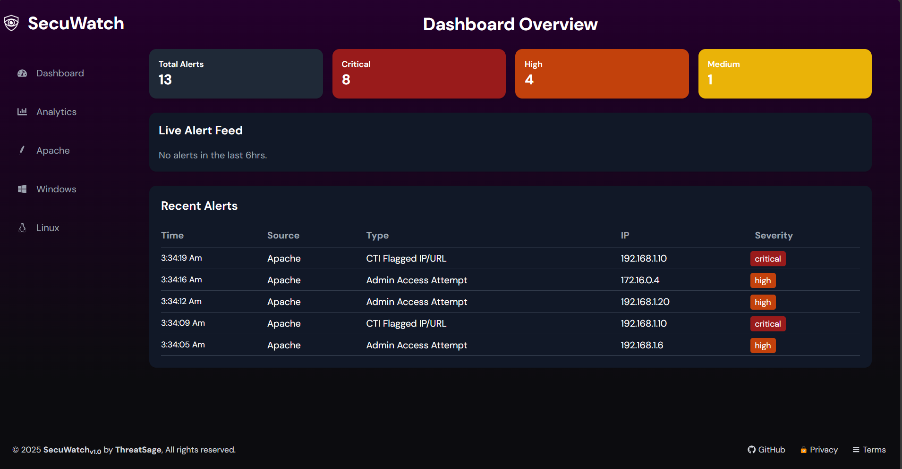
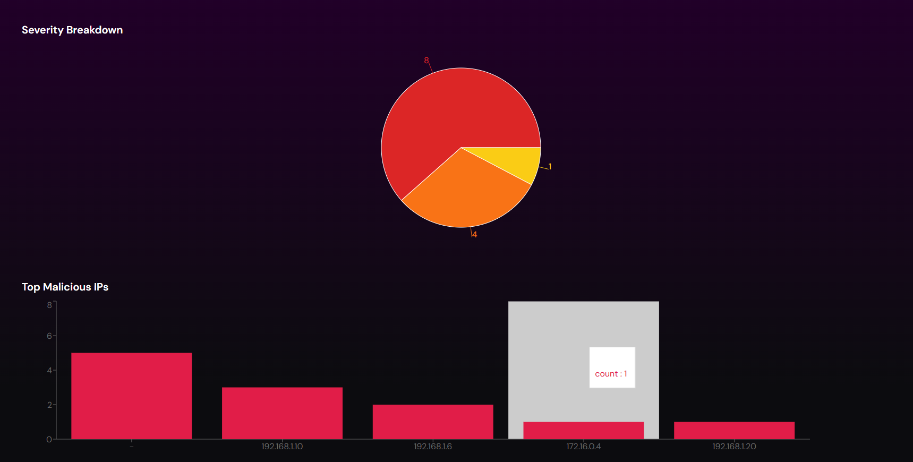
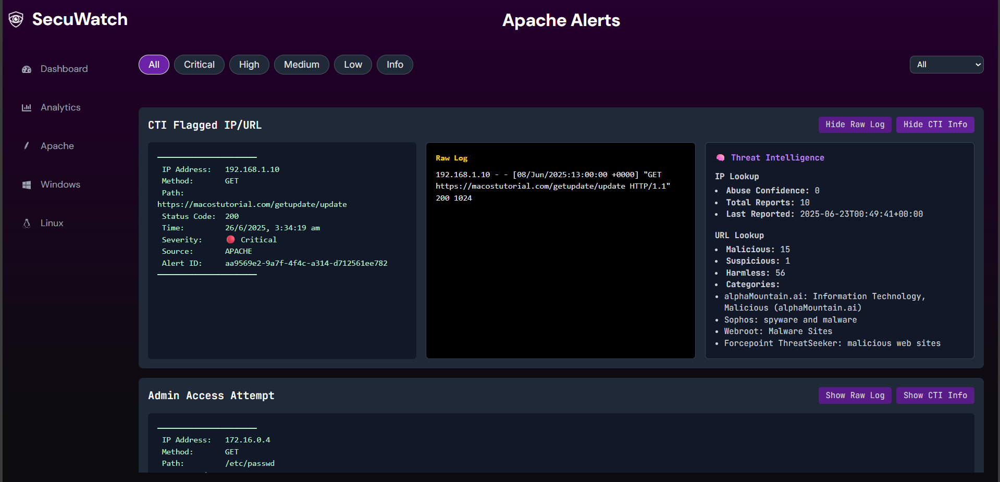
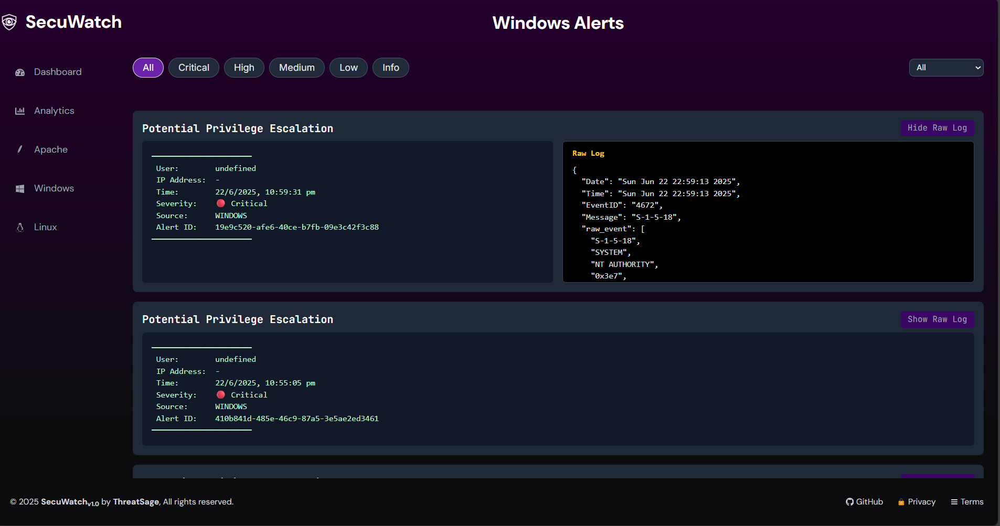
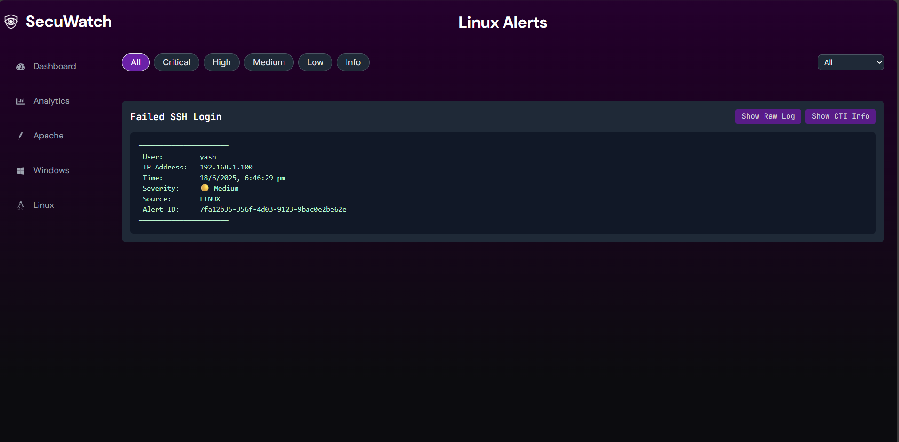

# 🛡️ SecuWatch: Threat Detection & Response Framework (v1.0)

**SecuWatch** is a full-stack cybersecurity tool for real-time log analysis, threat detection, and alert visualization. It integrates **FastAPI** (backend), **React + Tailwind CSS** (frontend), and **WebSockets** for live alert streaming. It supports authentication, CTI enrichment, and analytics dashboards — all in one lightweight solution.













---

## 📁 Project Structure

```
SecuWatch/
├── alert_handler/
│   ├── __init__.py
│   └── alert_writer.py          # Writes alerts & broadcasts to WebSocket
│
├── alerts/
│   ├── apache/                  # Apache-generated alerts
│   ├── linux/                   # Linux-generated alerts
│   └── windows/                 # Windows-generated alerts
│
├── backend/
│   ├── App.py                   # FastAPI WebSocket + REST API
│   ├── alerts_handler.py        # Alert source grouping logic
│   ├── ws_instance.py           # Shared WebSocket manager instance
│   ├── websocket_manager.py     # Manages WebSocket connections
│   ├── db.py                    # SQLite DB setup
│   └── auth/
│       ├── __init__.py
│       └── ...                  # Auth-related files (JWT, hashing, etc.)
│
├── cti_module/
│   ├── __init__.py
│   ├── .env                     # API keys (AbuseIPDB, VirusTotal)
│   ├── config.py                # Loads env vars
│   ├── cti_lookup.py            # CTI enrichment (IP, hash, URL)
│   └── test_cti_lookup.py       # Unit test for CTI functions
│
├── custom_fields/
│   └── severity.py              # Defines severity levels
│
├── detectors/
│   ├── apache_detector.py       # Detects suspicious Apache events
│   ├── linux_detector.py        # Detects Linux auth anomalies
│   └── windows_detector.py      # Detects Windows log anomalies
│
├── log_collectors/
│   ├── apache_collector.py          # Static Apache log collector
│   ├── apache_realtime_monitor.py   # Realtime Apache log monitor
│   ├── linux_collector.py           # Static Linux log collector
│   ├── linux_realtime_monitor.py    # Realtime Linux log monitor
│   ├── windows_collector.py         # Static Windows log collector
│   └── windows_realtime_monitor.py  # Realtime Windows log monitor
│
├── sample_logs/                 # Folder for test log files
│   └── ...                      # Example: linux_auth.log
│
├── config/
│   └── time_config.py           # Time utilities or formatting
│
├── additional/
│   └── banner.py                # Terminal banner on startup
│
├── frontend/                    # React + Tailwind frontend
│   └── ...                      # Pages: Dashboard, Login, Signup, etc.
│
├── secuwatch.db                 # SQLite database (users, etc.)
├── install.py                   # Setup script
├── main.py                      # Starts static/realtime log analysis
├── requirements.txt             # Python backend dependencies 
└── README.md

```

---

## 🚀 Features

-  Real-time and Static alert detection and delivery
-  WebSocket-based live feed
-  Analytics with charts (Recharts)
-  Central dashboard (Apache, Windows, Linux)
-  User authentication via SQLite + JWT
-  CTI integration ready (VirusTotal, AbuseIPDB)
-  Fully automatable with setup scripts

---

## ⚙️ Prerequisites

- **Python** 3.9+
- **Node.js** v16+
- **virtualenv** installed:
  ```bash
  pip install virtualenv
  ```

---

## 🧪 Setup Instructions

### 1️⃣ Clone the repository

```bash
git clone https://github.com/rastogi016/SecuWatch.git
cd SecuWatch
```

### 2️⃣ Run Setup Script (Auto installs backend + frontend)

  ```bash
  python install.py
  ```

> If using the Python version, it checks for `virtualenv` and Node.js before installing dependencies.

---

## 🚦 Launch the Application with Three Terminals

- Start backend only:
  ```bash
  uvicorn backend.App:app --reload
  ```

- Start frontend only:
  ```bash
  cd frontend
  npm run dev
  ```

- Run main engine:
  ```bash
  python main.py
  ```
## For Windows 
- Need Administrative Privilege

You will see:
- 🔁 `main.py` (log monitoring engine)
- 🌐 FastAPI backend → `http://localhost:8000`
- ⚛️ React frontend → `http://localhost:5173` (or next free port)

---

## 👤 Authentication

- First screen: **Login / Signup**
- Users stored in `secuwatch.db`
- Passwords hashed (bcrypt)
- JWT token stored in `localStorage`

---

## 📊 Dashboard & Analytics

-  Real-time Alerts by Source
-  Alerts Timeline Chart
-  Top IPs / URLs / Hashes
-  Severity Breakdown (low/medium/high)

---

## 🔧 Environment Variables (optional CTI)

To use VirusTotal or AbuseIPDB:

Create a `.env` file in root:
```
ABUSEIPDB_API_KEY=your_api_key
VT_API_KEY=your_api_key
```

---

## 🛠️ Development Scripts

- Start backend only:
  ```bash
  uvicorn backend.App:app --reload
  ```

- Start frontend only:
  ```bash
  cd frontend
  npm run dev
  ```

- Run main engine:
  ```bash
  python main.py
  ```

---

## 🧹 To-Do (Future Enhancements)

-  Integrate machine learning for anomaly detection
-  Dockerize frontend/backend
-  Email or webhook notifications
-  And Many More.....

---

## 🪪 License

MIT License © Threat Sage

---

## 🧠 Author

**Yash Rastogi**  
[LinkedIn](https://www.linkedin.com/in/yashrastogi11) · [GitHub](https://github.com/rastogi016)

---

## ☁️ Deploy (Vercel + Backend Host)

Because the backend uses FastAPI WebSockets, deploy the frontend on Vercel and the backend on a host that supports long-lived connections (Render, Railway, Fly.io, etc.).

1) Backend (Render/Railway)
- Create a new Web Service from this repo.
- Runtime: Python 3.11+. Start command:
  ```bash
  uvicorn backend.App:app --host 0.0.0.0 --port $PORT
  ```
- Env vars: set `MONGODB_URI` and any CTI keys.
- Expose port: use platform-provided `$PORT`.

Optional (Railway): add a `Procfile` with: `web: uvicorn backend.App:app --host 0.0.0.0 --port $PORT`.

2) Frontend (Vercel)
- Project root: `frontend/`
- Build Command: `npm run build`
- Output Directory: `dist`
- Env vars (Project → Settings → Environment Variables):
  - `VITE_API_BASE_URL` → e.g. `https://<your-backend-host>`
  - `VITE_WS_URL` → e.g. `wss://<your-backend-host>/ws/alerts`

3) Local env
- See `frontend/.env.example`. For local dev create `frontend/.env` or `.env.local`:
  ```
  VITE_API_BASE_URL=http://localhost:8000
  VITE_WS_URL=ws://localhost:8000/ws/alerts
  ```

4) Frontend API/WS are already parameterized to use these variables and fall back to localhost when not set.
